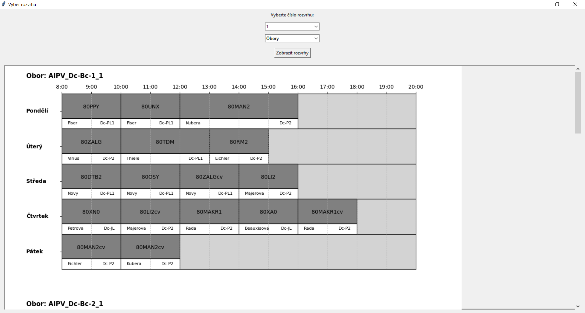

# Popis programu
Tento program tvoří rozvrhy hodin pro vysoukou školu ČVUT pro děčínské pracoviště. Program tvoří maximální počet rozvrhů hodin, které dokáže vytvořit. Po vytvoření se rozvrhy vypisují do gui, kde uživatel má možnost si vytvořené rozvrhy prohlížet.

## Vstupní data
Program čerpá data zapsaná v 7 vstupních souborech formátu CSV nebo JSON:
### *obor_predmet.csv*
```
obor, předmět, počet přednášek
AIPV_Dc-Bc-1_1,80DTB2,1                                     
AIPV_Dc-Bc-1_1,80LI2,1                                      
AIPV_Dc-Bc-1_1,80LI2cv,1                                       
```
### *predmet_delkaPredmetu.csv*
```
predmět, délka předmětu v hodinách
16PADR,2            
16SEM,2             
16ZPRD,3                
```
### *predmet_mistnost_poradi.csv*
Pořadím se rozumí pořadí, ve kterém se budou volit místnosti pro zápis předmětů. Pokud první bude obsazená, na řadu přijde druhá, atd.
```
předmět, místnost, pořadí
16PADR,Dc-PL1,1          
16SEM,Dc-FL,1           
16ZPRD,Dc-P4,1          
```
### *predmety_napevno.csv*
Tento soubor obsahuje předměty, které chcete umístit do rozvrhu předem. Při tvorbě rozvrhu se tyto předměty zapíší do šablony rozvrhu a teprve pak program tak začne vpisovat předměty. Den je brán od 1 (1 = pondělí). Čas je hodina, od které se přednáška začíná vyučovat zmenšená o 7 (1 = od 8h).
```
Předmět, Učitel, Místnost, Den, Čas, Délka přednášky
16SEM,JmenoVyucujiciho_1,Dc-pom,3,2,2
80MAN2cv,JmenoVyucujiciho_1,Dc-P2,5,1,2
80MAN2cv,JmenoVyucujiciho_2,Dc-P2,5,3,2
```
### *vyucujici_predmet_pocetPrednasek.csv*
```
Jméno vyučujícího, předmět, počet přednášek
JmenoVyucujiciho_1,80XA0,1                                                          
JmenoVyucujiciho_1,80XA2,1                                                          
JmenoVyucujiciho_2,80FY2,1                                                          
```
### *mistnosti_casy.json*
Tento soubor obsahuje volna učeben. Pokud je na první pozici 1, tak učebna je pro časový slot od 8h do 9h volná. Pokud je tam 0, tak se obsazená. Tohoto se dá využít, když potřebujete místnost využít pro nějaký kroužek, aby se do této místnosti nezapisovaly předměty ve zvolený čas.
```
[
    {
        "name": "Dc-P2",
        "Po": [1,1,1,1,1,1,1,1,1,1,1,1],
        "Ut": [1,1,1,1,1,1,1,1,0,0,0,1],
        "St": [1,1,1,1,1,1,1,1,1,1,1,1],
        "Ct": [1,1,1,1,1,1,1,1,1,1,1,1],
        "Pa": [1,1,1,1,1,1,1,1,1,1,1,1]
        
    },
    {
        "name": "Dc-P4",
        "Po": [1,1,1,1,1,1,1,1,1,1,1,1],
        "Ut": [1,1,1,1,1,1,1,1,1,1,1,1],
        "St": [1,1,1,1,1,1,1,1,1,1,1,1],
        "Ct": [1,1,1,1,1,1,1,1,1,1,1,1],
        "Pa": [1,1,1,1,1,1,1,1,1,1,1,1]
    }
]
```
### *vyucujici_casy.json*
Tento soubor obsahuje volna vyučujících. Pokud je na první pozici 1, tak vyučující má pro časový slot od 8h do 9h volno. Pokud je tam 0, tak volno nemá, tedy nemůže vyučuvat. 
```
[
    {
        "name": "JmenoVyucujiciho_1",
        "Po": [1,1,1,1,1,1,1,1,1,1,1,1],
        "Ut": [1,1,1,1,1,1,1,1,0,0,0,1],
        "St": [1,1,1,1,1,1,1,1,1,1,1,1],
        "Ct": [1,1,1,1,1,1,1,1,1,1,1,1],
        "Pa": [1,1,1,1,1,1,1,1,1,1,1,1]
        
    },
    {
        "name": "JmenoVyucujiciho_2",
        "Po": [1,1,1,1,1,1,1,1,1,1,1,1],
        "Ut": [1,1,1,1,1,1,1,1,1,1,1,1],
        "St": [1,1,1,1,1,1,1,1,1,1,1,1],
        "Ct": [1,1,1,1,1,1,1,1,1,1,1,1],
        "Pa": [1,1,1,1,1,1,1,1,1,1,1,1]
    }
]
```
Soubory formátu CSV mají první řádek volný. Tento řádek je určen pro přápadné komentáře a při běhu kódu bude vynechán. Ani před ani za (pokud je za tímto sloupcem další sloupec) sloupci nesmí být mezera.

## Běh programu
Program ukončí svůj běh a vypíše všechny chyby co našel do souboru *logs/chyby.txt*. 
```
[CHYBA] V souboru: predmety_napevno.csv, na řádku: 20, místnost NENÍ volná tento čas.
```
Pokud chyby nalezeny nebyly, pak program pokračuje ke tvorbě rozvrhů. Program vypisuje do konzole uživateli 
informaci, zda nějaké rozvrhy našel. Pokud žádné nenašel je potřeba se podívat do XLSX souboru *vlivy_predmety_hodnoty_nezapPredmety.xlsx*. Tento excelový soubor obsahuje data o nevytvořených rozvrzích obsažená ve 4 listech:
1. vektory vlivů
2. posloupnost předmětů, ve kterém se předměty zapisovaly
3. hodnocení předmětů v primárním řazení (první řádek)
4. nezapsané předměty


Tento soubor se vytvoří i v případě, že nějaké rozvrhy byly nalezeny. Data tohoto souboru by měli pomoci nalézt případné příčiny nenalezení rozvrhů. Pokud se rozvrhy najdou, tak se spustí gui:

Nahoře máte možnost vybírat vytvořené rozvrhy a poté stačí zmáčknout "Zobrazit rozvrhy". Tím se zobrazí rozvrhy pro všechny obory. Vytvořené rozvrhy jsou různé. Číslo značí index sady rozvrhů. Do konzole se také vypíší hodnoty:
``` 
Maximální povolený počet přepsání předmětů: [3, 23]
Nalezeno rozvrhu: 5376
Ruznych rozvrhu je: 55
Kód běžel 25.36 sekund.
```
Pokud se spustí gui, tak to znamená že se rozvrh našel. V připadě, že ne, tak se jedná a chyby, vypsané do souboru *chyby.txt*, nebo o příliš striktní omezení vyučujících a místností.


## Požadavky
- Python 3.9
- `pip` (Python package installer)

## Instalace
1. Přesuňte se do složky s algoritmem
2. V průzkumníku souborů klikněte na "Domů" a spusťte PowerShell
3. Vytvořte virtuální prostředí:
    ```
    py -m venv venv
    ```
4. Aktivujte virtuální prostředí:
    - Windows: 
    ```
    venv\Scripts\activate
    ```
    - macOS/Linux: 
    ```
    source venv/bin/activate
    ```
5. Nainstalujte závislosti:
    ```
    py -m pip install -r requirements.txt
    ```
6. Spusťte program 
    ```
    py main.py
    ```
